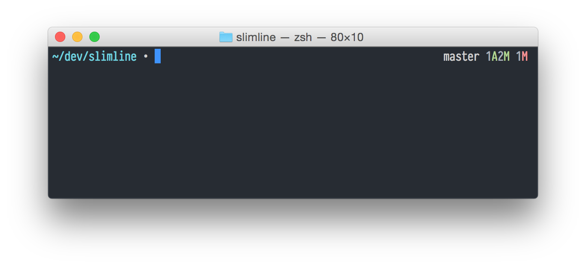
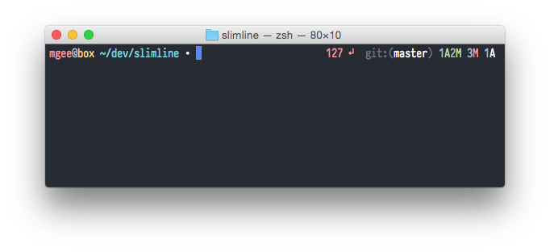
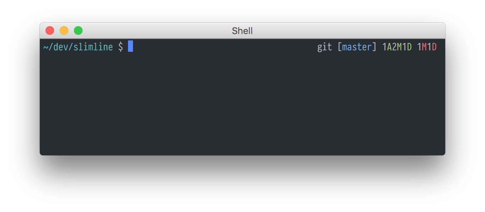

## slimline

Modular, fast and elegant ZSH prompt. Displays the right information at the right time.

<p align="center"></p>

Features:
- sleek look
- modular layout using configurable sections in the left and right prompt
- the appearance of each section can be customized using format strings
- easily extensible using custom sections (which can be optionally asynchronous)
- fast non-blocking prompt using asynchronous information display

Sections:
- prompt symbol which indicates if asynchronous tasks are running
- current working directory which highlights if it is the root `/` directory
- exit code of last command if the exit code is not zero
- runtime of executed command if it exceeds a threshold
- username and hostname if connected to a ssh server or optionally always
- current time of day in 24h or 12h format
- current aws profile
- current python virtualenv
- nodejs version configured for the current directory
- customizable git information display

With more information (connected to ssh server, runtime and exit status from last command, aws profile and nodejs version):

<p align="center"></p>

<!-- TOC -->

- [slimline](#slimline)
- [Requirements](#requirements)
    - [Optional](#optional)
- [Installation](#installation)
    - [antigen](#antigen)
    - [zplugin](#zplugin)
    - [zgen](#zgen)
    - [Manually](#manually)
- [Sections and Formats](#sections-and-formats)
- [Legacy Options](#legacy-options)
- [Global Options](#global-options)
    - [Left Prompt](#left-prompt)
    - [Right Prompt](#right-prompt)
    - [Spelling Prompt](#spelling-prompt)
- [Built-in Sections](#built-in-sections)
    - [Prompt Symbol (`symbol`)](#prompt-symbol-symbol)
    - [Current Working Directory (`cwd`)](#current-working-directory-cwd)
    - [Exit Status (`exit_status`)](#exit-status-exit_status)
    - [Execution Time (`execution_time`)](#execution-time-execution_time)
    - [User and Host Info (`user_host_info`)](#user-and-host-info-user_host_info)
    - [Time (`time`)](#time-time)
    - [AWS Profile (`aws_profile`)](#aws-profile-aws_profile)
    - [Python Virtualenv (`virtualenv`)](#python-virtualenv-virtualenv)
    - [Node.js (`nodejs`) *async*](#nodejs-nodejs-async)
    - [Git (`git`) *async*](#git-git-async)
- [Custom Sections](#custom-sections)
    - [Functions](#functions)
        - [Render](#render)
        - [Init](#init)
        - [Preexec](#preexec)
        - [Precmd](#precmd)
        - [Async Task](#async-task)
    - [Utility Functions](#utility-functions)
        - [Section Format Expansion](#section-format-expansion)
        - [Logging](#logging)
        - [Callable Check](#callable-check)
    - [Examples](#examples)
        - [Minimal Section](#minimal-section)
        - [Section with init function](#section-with-init-function)
        - [Section with asynchronous task](#section-with-asynchronous-task)
- [Example](#example)
- [Thanks](#thanks)
- [License](#license)

<!-- /TOC -->

## Requirements

* zsh

### Optional

* python 2.6+ to enable git information display

## Installation

Choose one of the methods below.

### antigen

```
antigen bundle mgee/slimline
```

### zplugin

```
zplugin load mgee/slimline
```

### zgen

```
zgen load mgee/slimline
```

### Manually

Clone the repository:

```shell
git clone --recursive https://github.com/mgee/slimline.git
```

Source the prompt in your `.zshrc` (or other appropriate) file:

```shell
source <path-to-slimline>/slimline.zsh
```

## Sections and Formats

Slimline has two prompts. The left and right prompt. In each prompt sections can be placed and
ordered. The appearance of each section can be completely customized.

A section displays information like the current directory or the git status. Slimline provides
a number of sections by default but can also be extended with [custom sections](#custom-sections).
Each sections has a format string which can be customized to change the color or text
inside the section.

Inside the format of the section placeholders can be used which will be replaced with information
specific to this section. Placeholders are enclosed in pipes `|`, eg. the placeholder `|path|`
in the [`cwd` section](#current-working-directory-cwd).

## Legacy Options

Slimline uses a new option format but supports the previous options as fallback by setting
`SLIMLINE_PROMPT_VERSION` to `1`:
```shell
export SLIMLINE_PROMPT_VERSION=1 # Activate legacy option format
```

The legacy options are described [here](legacy_options.md).

## Global Options

| Variable | Default | Meaning |
| :------- | :-----: | ------- |
| `SLIMLINE_PROMPT_VERSION` | `2` | The version of the prompt options. To use the legacy options described [here](legacy_options.md) set it to `1`. |
| `SLIMLINE_ENABLE_ASYNC_AUTOLOAD` | `1` | Defines whether [zsh-async](https://github.com/mafredri/zsh-async) should be automatically sourced if it was not already sourced. Disabling the automatic loading is useful if zsh-async is installed globally and therefore already loaded (e.g. via antigen or zplugin). |

### Left Prompt

| Variable | Default | Meaning |
| :------- | :-----: | ------- |
| `SLIMLINE_LEFT_PROMPT_SECTIONS` | `user_host_info cwd symbol` | The sections to use in the left prompt. |
| `SLIMLINE_LEFT_PROMPT_SECTION_SEPARATOR` | ` ` | The separator between each section. |
| `SLIMLINE_LEFT_PROMPT_FORMAT` | `\|sections\| ` | The format string for the left prompt (notice the space at the end). The `\|sections\|` placeholder will be replaced with the section output. |

### Right Prompt

| Variable | Default | Meaning |
| :------- | :-----: | ------- |
| `SLIMLINE_RIGHT_PROMPT_SECTIONS` | `execution_time exit_status git aws_profile virtual_env nodejs` | The sections to use in the right prompt. |
| `SLIMLINE_RIGHT_PROMPT_SECTION_SEPARATOR` | ` ` | The separator between each section. |
| `SLIMLINE_RIGHT_PROMPT_FORMAT` | `\|sections\|` | The format string for the right prompt. The `\|sections\|` placeholder will be replaced with the section output. |

### Spelling Prompt

| Variable | Default | Meaning |
| :------- | :-----: | ------- |
| `SLIMLINE_SPELLING_PROMPT_FORMAT` | `zsh: correct %F{red}\|from\|%f to %F{green}\|to\|%f [nyae]? ` | The format string for spelling prompt which is shown for auto correction. The `\|from\|` placeholder will be replaced with the incorrect command and `\|to\|` with the correction. |

## Built-in Sections

### Prompt Symbol (`symbol`)

The section displayes the prompt symbol. It supports two formats. The *working* format is used when asynchronous tasks are
pending and the *ready format for when all tasks are completed.

| Variable | Default | Meaning |
| :------- | :-----: | ------- |
| `SLIMLINE_SYMBOL_WORKING_FORMAT` | `%F{red}∙%f` | The format to use for the symbol when there are asynchronous tasks pending. |
| `SLIMLINE_SYMBOL_READY_FORMAT` | `%F{white}∙%f` | The format to use for the symbol when all asynchronous tasks have completed. |

### Current Working Directory (`cwd`)

This section displays the current working directory. It supports two formats.
The *root* format is used when the cwd is the root path and the other format when it is not.

| Variable | Default | Meaning |
| :------- | :-----: | ------- |
| `SLIMLINE_CWD_FORMAT` | `%F{cyan}\|path\|%f` | The format to use when the current working directory is in a normal directory (not the root path `/`). The placeholder for the path is `\|path\|`. |
| `SLIMLINE_CWD_ROOT_FORMAT` | `%F{red}\|path\|%f` | The format to use when the current working directory is in the root path `/`. The placeholder for the path is `\|path\|`. |

### Exit Status (`exit_status`)

The section displays the exit status of the last command if it is != 0.

| Variable | Default | Meaning |
| :------- | :-----: | ------- |
| `SLIMLINE_EXIT_STATUS_FORMAT` | `%F{red}\|exit_status\| ↵%f` | The format to use when the exit status of the last command is != 0. The placeholder for the exit status value is `\|exit_status\|`. |

### Execution Time (`execution_time`)

The execution time of the last command if it exceeds the configurable threshold.

| Variable | Default | Meaning |
| :------- | :-----: | ------- |
| `SLIMLINE_MAX_EXEC_TIME` | `5` | The maximum execution time of a process in seconds until its run time is displayed on exit. |
| `SLIMLINE_EXECUTION_TIME_FORMAT` | `%F{yellow}\|time\|%f` | The format of the execution time display. The placeholder for the execution time in seconds is `\|time\|`. |

### User and Host Info (`user_host_info`)

This section displays user and host information and supports two formats.
The *root* format is used if the current user is root.
By default the user and host information is only displayed if the user is different than the
default user or if there is an active ssh session.

| Variable | Default and Description |
| :------- | ----------------------- |
| `SLIMLINE_ALWAYS_SHOW_USER_HOST_INFO` | `0` <hr/> Defines whether the user and host information should always be displayed. |
| `SLIMLINE_USER_HOST_INFO_DEFAULT_USER` | `$USER` <hr/> The default user for this prompt. This is used to hide the user and host name if the current user is the same as the default user. |
| `SLIMLINE_USER_HOST_INFO_FORMAT` | `%F{green}\|user\|%F{white}@%F{yellow}\|host\|%f` <hr/> The format of user and host info if the user is **not** root. The placeholder for the username is `\|user\|` and for the hostname is `\|host\|`. |
| `SLIMLINE_USER_HOST_INFO_ROOT_FORMAT` | `%F{red}\|user\|%F{white}@%F{yellow}\|host\|%f` <hr/> The format of user and host info if the user **is** root. The placeholder for the username is `\|user\|` and for the hostname is `\|host\|`. |

### Time (`time`)

This section displays the current time in 24h format and is disabled by default.
To use it add it to your left or right prompt manually. To use the 12h time format use the `|time12|` placeholder.

| Variable | Default | Meaning |
| :------- | :-----: | ------- |
| `SLIMLINE_TIME_FORMAT` | `%F{white}\|time24\|%f` | The format to use for displaying the time of day. The placeholder for the time in 24h format is `\|time24\|`. The placeholder for the time in 12h format is `\|time12\|`. |

### AWS Profile (`aws_profile`)

This section displays the current aws profile detected via the `$AWS_PROFILE` environment variable.

| Variable | Default | Meaning |
| :------- | :-----: | ------- |
| `SLIMLINE_AWS_PROFILE_FORMAT` | `%F{white}[AWS:%F{blue}\|profile\|%F{white}]%f` | The format to use for displaying the aws profile. The placeholder for the profile is `\|profile\|`. |

### Python Virtualenv (`virtualenv`)

This section displays the current python virtual env detected via the `$VIRTUAL_ENV` environment variable.

| Variable | Default | Meaning |
| :------- | :-----: | ------- |
| `SLIMLINE_VIRTUALENV_FORMAT` | `%F{white}[VENV:%F{cyan}\|basename\|%F{white}]%f` | The format to use for displaying the virtual env information. The placeholder for the basename of the virtual env is `\|basename\|`. |

### Node.js (`nodejs`) *async*

This section displays the nodejs version if the current directory contains a `package.json` file or `node_modules` directory.

| Variable | Default and Description |
| :------- | ----------------------- |
| `SLIMLINE_NODEJS_FORMAT` | `%F{white}[%F{green}⬢ \|version\|%F{white}]%f`<hr/> The format to use for displaying the nodejs information. The placeholder for the configured version of nodejs is `\|version\|`. |

### Git (`git`) *async*

This section displays various git status information.
It uses [gitline](https://github.com/mgee/gitline) to acquire and format the git information.
gitline can be extensively customized. Have a look at the [gitline options](https://github.com/mgee/gitline#options).

Additionally this section has the following options:

| Variable | Default | Meaning |
| :------- | :-----: | ------- |
| `SLIMLINE_GIT_FORMAT` | `\|output\|` | The format to use for the git status information. The placeholder `\|output\|` is replaced with the output from gitline. |

## Custom Sections

Custom sections can be easily written by following the slimline section naming scheme.
This way sections are automatically discovered and can execute asynchronous tasks easily.

Sections use the namespace `slimline::section::<name>` where name is replaced by the
section name. Each section needs at least a `render` function.
For a section with the name `foo` the render function is named `slimline::section::foo::render`.

A section can have the following functions:

| Function | Required | Meaning |
| :------- | :-----: | ------- |
| `slimline::section::<name>::render` | **yes** | This function is used to display information in the prompt. |
| `slimline::section::<name>::init` | no | This function can initialize data and check for requirements for the section. If the function returns `0` the section will be loaded. In case the section shall be deactivated return `1` instead. |
| `slimline::section::<name>::preexec` | no | If the function is defined it will be executed right before a new command in zsh is executed. |
| `slimline::section::<name>::precmd` | no | If the function is defined it will be executed before the prompt render functions. |
| `slimline::section::<name>::async_task` | no | This function will be executed asynchronously by zsh-async and its output will be available in the `async_task_complete` function.
| `slimline::section::<name>::async_task_complete` | no | This function is not required except when the `async_task` function is defined. This function will receive the output of the `async_task` function and other information. |

### Functions

#### Render

#### Init

#### Preexec

#### Precmd

#### Async Task

### Utility Functions

#### Section Format Expansion

#### Logging

#### Callable Check

### Examples

#### Minimal Section

#### Section with init function

```shell
slimline::section::foo::init() {
  if slimline::utils::callable "ruby"; then
    return 0 # Ok, section can be loaded
  fi

  slimline::utils::warning "ruby not installed or not in PATH, disabling foo section"
  return 1 # Disable the section
}

slimline::section::foo::render() {
  echo "%F{blue}bar%f"
}

# Add it to the right prompt
export SLIMLINE_RIGHT_PROMPT_SECTIONS="foo execution_time exit_status git aws_profile virtual_env nodejs"
```

#### Section with asynchronous task

```shell
slimline::section::foo::precmd() {
  unset slimline_section_foo_output
}

slimline::section::foo::async_task() {
  sleep 2
  echo "bar"
}

slimline::section::foo::async_task_complete() {
  slimline_section_foo_output=$3
}

slimline::section::foo::render() {
  echo "${slimline_section_foo_output}"
}

# Add it to the right prompt
export SLIMLINE_RIGHT_PROMPT_SECTIONS="foo execution_time exit_status git aws_profile virtual_env nodejs"
```

## Example

Here is an example for customizing the prompt symbol as well as the git repository indicator and
branch format:

```shell
export SLIMLINE_SYMBOL_READY_FORMAT="%F{white}\$%f"
export SLIMLINE_SYMBOL_WORKING_FORMAT="%F{red}\$%f"

# If you have a powerline compatible font you can also use the alternative repo indicator ''.
export GITLINE_REPO_INDICATOR='${reset}git'
export GITLINE_BRANCH='[${blue}${branch}${reset}]'

source "<path-to-slimline>/slimline.zsh"
```

<p align="center"></p>

## Thanks

- [mafredri/zsh-async](https://github.com/mafredri/zsh-async)
- [sindresorhus/pure](https://github.com/sindresorhus/pure)
- [denysdovhan/spaceship-prompt](https://github.com/denysdovhan/spaceship-prompt)
- [sorin-ionescu/prezto](https://github.com/sorin-ionescu/prezto.git)

## License

Released under the [MIT License](LICENSE)
